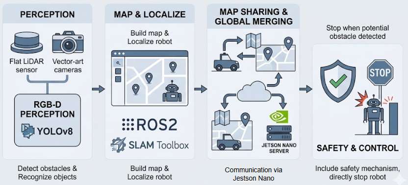

# SmartCam — Autonomous Multi-Agent RC Car System

> **ELEC 594 Capstone Project · Rice University · Spring 2026**  
> **Team:** Ashley Garcia · Mehul Goel · Youjia (Bill) Tong · Chenghao (Steve) Xiang  
> **Mentor:** Dr. Jose R. Moreto

---

## Table of Contents

1. [Project Overview](#1-project-overview)
2. [System Architecture](#2-system-architecture)
3. [Hardware](#3-hardware)
4. [Software Prerequisites](#4-software-prerequisites)
5. [Quick-Start Guide](#5-quick-start-guide)
6. [Results Summary](#6-results-summary)
7. [Known Issues & Troubleshooting](#7-known-issues--troubleshooting)
8. [Contribution & Final Notes](#8-contribution--final-notes)

---

## 1. Project Overview

SmartCam is a collaborative SLAM (Simultaneous Localization and Mapping) framework for a fleet of autonomous RC cars. Each car builds a local 2D occupancy-grid map using onboard sensors and shares compressed pose-graphs with a central server over a Tailscale VPN. The server merges these submaps into a single globally-consistent map via GTSAM factor-graph optimization and broadcasts the result back to the fleet.

**Core capabilities:**

| Capability | Technology |
|---|---|
| 2D SLAM & Localization | SLAM Toolbox + GTSAM (ROS 2 Humble) |
| Multi-agent map merging | Centralized Jetson Orin Nano server |
| Semantic obstacle avoidance | YOLOv8n + Intel RealSense D415 |
| Automatic Emergency Braking | HC-SR04 ultrasonic + TTC logic |
| Campus-wide wireless comms | Tailscale VPN + Zenoh ROS 2 bridge |

---

## 2. System Architecture

<p align="center">
  
</p>

**Data flow per car:**
1. LiDAR + Wheel Encoder + IMU → Kalman Filter → SLAM Toolbox
2. SLAM Toolbox (GTSAM backend) → local 2D occupancy grid + pose-graph
3. YOLOv8n + RealSense depth → 3D obstacle coordinates → ROS 2 costmap
4. HC-SR04 → TTC check → AEB motor override (if TTC < threshold)
5. Compressed pose-graph → Tailscale VPN → Zenoh → Central server
6. Server merges maps → broadcasts global map → Nav2 path planning

---

## 3. Hardware

### 3.1 HiWonder full documentation: https://docs.hiwonder.com/projects/MentorPi/en/latest/docs/1.getting_ready.html

| Component | Model | Notes |
|---|---|---|
| Robot base | HiWonder MentorPi M1 | Includes built-in LiDAR, IMU, wheel encoders |
| Compute (high-level) | NVIDIA Jetson Nano | GPU inference for YOLOv8n |
| Compute (low-level) | Raspberry Pi 5 Model B | SLAM, control loops, AEB |
| Safety sensor | HC-SR04 ultrasonic | Forward AEB (2–400 cm) |
| Vision | Intel RealSense D415 | Depth camera for 3D obstacle projection |

---

## 4. Software Prerequisites

### 4.1 Operating System

- **All ROS 2 nodes:** Ubuntu 22.04 LTS (Jammy)
- **VM (for visualization):** VMware or VirtualBox with Ubuntu 22.04 + RealVNC Viewer

### 4.2 ROS 2 Humble Installation

Run the following on **every device** (HiWonder, RPi 5, Jetson, and VM):

```bash
sudo apt install software-properties-common
sudo add-apt-repository universe
sudo apt update && sudo apt install curl -y

# Add ROS 2 apt source
export ROS_APT_SOURCE_VERSION=$(curl -s \
  https://api.github.com/repos/ros-infrastructure/ros-apt-source/releases/latest \
  | grep -F "tag_name" | awk -F\" '{print $4}')
curl -L -o /tmp/ros2-apt-source.deb \
  "https://github.com/ros-infrastructure/ros-apt-source/releases/download/${ROS_APT_SOURCE_VERSION}/ros2-apt-source_${ROS_APT_SOURCE_VERSION}.$(. /etc/os-release && echo ${UBUNTU_CODENAME:-$VERSION_CODENAME})_all.deb"
sudo dpkg -i /tmp/ros2-apt-source.deb

sudo apt update && sudo apt upgrade
sudo apt install ros-humble-desktop ros-dev-tools python3-colcon-common-extensions

# Auto-source in every terminal
echo "source /opt/ros/humble/setup.bash" >> ~/.bashrc
```

### 4.3 ROS 2 Packages

```bash
sudo apt install \
  ros-humble-slam-toolbox \
  ros-humble-navigation2 \
  ros-humble-nav2-bringup \
  ros-humble-robot-localization \
  ros-humble-imu-tools \
  ros-humble-realsense2-camera
```

### 4.4 YOLOv8 (Ultralytics)

```bash
# Create and activate a virtual environment
python3 -m venv ultralytics-env
source ultralytics-env/bin/activate
pip install ultralytics

# Verify installation
python3 -c "from ultralytics import YOLO; print('Ultralytics YOLO ready')"

# Deactivate when done
deactivate
```

### 4.5 TensorRT (Jetson only — for FP16 inference)

Follow the NVIDIA JetPack SDK documentation for TensorRT installation matching your JetPack version. The YOLOv8n `.engine` file is exported once and cached for subsequent runs:

```bash
# Export YOLOv8n to TensorRT FP16 (run once on the Jetson)
source ultralytics-env/bin/activate
python3 -c "
from ultralytics import YOLO
model = YOLO('yolov8n.pt')
model.export(format='engine', half=True)  # Exports yolov8n.engine
"
```

### 4.6 Tailscale (All devices)

```bash
# Install Tailscale
curl -fsSL https://tailscale.com/install.sh | sh

# Authenticate (follow the printed URL)
sudo tailscale up

# Verify your Tailscale IP
tailscale ip
```

After installing on all devices, disable **Key Expiry** for each device in the Tailscale Admin Console so authentication persists across reboots.

### 4.7 Zenoh ROS 2 Bridge (All devices)

Download the correct binary from https://github.com/eclipse-zenoh/zenoh-plugin-ros2dds/releases:
- **Jetson / RPi 4 (ARM64):** `aarch64` build
- **Laptop/VM (x86\_64):** matching OS build

Extract and locate the `zenoh-bridge-ros2dds` executable; see [docs/wireless\_communication.md](docs/wireless_communication.md) for full setup.

---

## 5. Quick-Start Guide

**All commands run inside `leader_car/ros2_ws/`.**

#### Step 1 — Build the workspace

```bash
cd ~/elec555_ws          # or your local clone path
colcon build --symlink-install
source /opt/ros/humble/setup.bash
source install/setup.bash
```

#### Step 2 — Launch the robot controller

Open **Terminal 1**:
```bash
ros2 launch controller controller.launch.py
```

#### Step 3 — Launch SLAM

Open **Terminal 2** (monitor CPU):
```bash
top
```

Open **Terminal 3** (monitor map latency):
```bash
ros2 topic delay /map
```

Open **Terminal 4** (start SLAM):
```bash
source /opt/ros/humble/setup.bash && source install/setup.bash
ros2 launch slam slam.launch.py
```

Open **Terminal 5** (record a bag for post-processing):
```bash
# LiDAR-only baseline
ros2 bag record /tf /tf_static /scan_raw /map

# LiDAR + Encoder (add these topics)
ros2 bag record /tf /tf_static /scan_raw /map /odom /cmd_vel
```

#### Step 4 — Visualize on the VM

On your laptop/VM:
```bash
# Terminal A — RViz
ros2 launch slam rviz_slam.launch.py
# In RViz: set Fixed Frame → "map", add Map, LaserScan, TF displays

# Terminal B — Keyboard teleoperation
ros2 run teleop_ctrl teleop_ctrl
```

Drive the car around to build the SLAM map. Use arrow keys as instructed in the teleop terminal.

## 6. Results Summary

| Metric | Value |
|---|---|
| AEB sensor loop latency | ~11.5 ms |
| AEB ROS 2 handoff latency | ~0.1 ms |
| AEB data rate | 15 Hz |
| Zenoh bandwidth reduction vs. raw DDS | ~90% |
| YOLOv8n confidence (cell phone, bright) | 0.90 |
| YOLOv8n confidence (person, low-light) | 0.40 |
| SLAM Latency — LiDAR only | ~210 ms |
| SLAM Latency — LiDAR + Encoder | ~4700 ms |
| SLAM CPU — LiDAR only | 94.6% |
| SLAM CPU — LiDAR + Encoder | 55.3% |
| SLAM Load — LiDAR only | 0.63 |
| SLAM Load — LiDAR + Encoder | 1.24 |

---

## 7. Known Issues & Troubleshooting

| Issue | Cause | Fix |
|---|---|---|
| `ros2 run demo_nodes_py talker` not received across Zenoh | ROS\_DOMAIN\_ID mismatch between devices | Set `export ROS_DOMAIN_ID=0` (or same value) on **both** devices before launching Zenoh bridge |
| Zenoh GID mismatch warning in logs | ROS 2 Humble vs. Iron GID size difference | Cosmetic warning only; data still flows. Set `ROS_DISTRO=humble` env var on both sides |
| SLAM map drifts in open corridors | LiDAR has no geometric features to match | Drive near walls; enable wheel encoder odometry for better constraint |
| RealSense depth dropout at close range | D415 minimum range ~0.3 m | Use ultrasonic AEB as fallback for obstacles closer than 0.5 m |
| Jetson Nano out of memory during SLAM + YOLO | Concurrent GPU/CPU load | Assign SLAM to CPU cores, restrict YOLOv8n to GPU via `device=0` flag |

---

## 8. Contribution & Final Notes

See individual contribution guidelines per team member in the [Credit Author Statement]. For further documentation, please refer to documentation section and HiWonder_MentorPi_M1 section.
---
