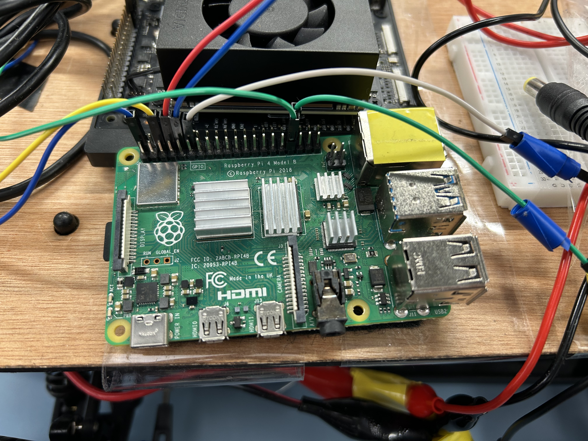

# About this Project

This project is focusing on self-navigation smart RC-cars system. Started from spring semester, 2025. For the exact development history, please check the Chapter "Developing History".

The project contains 2 modules, including leader car and follower car. When developing the system, please first refer the chapter "Leader Car", and then refer the chapter "Follower Car". 

---

## Developing History


---

## Leader Car

The leader car do the navigation in indoor condition. 

### Step 1: Hardware Choosing and Assembling

For the hardware, we used Hiwonder MentorPi M1 Robot car as the leader. Refer below documentation for Hiwonder
https://docs.hiwonder.com/projects/MentorPi/en/latest/docs/1.getting_ready.html

---

### Step 2: Software Programming

Run these commands inside the `leaser_car/ros2_ws` directory to build the SLAM packages and source the environment.

```zsh
# Build the workspace with symlink installation
colcon build --symlink-install

# To run the leader car run below commands in the terminal
ros2 launch controller controller.launch.py
ros2 run teleop_ctrl teleop_ctrl	# Control the robot with the help of keyboard keys as instructed in the same terminal

# Source the overlay (using ZSH)
source install/setup.zsh

# To run LiDAR based SLAM, follow the commands in the terminal
sudo apt install ros-humble-toolbox		# to install SLAM toolbox
ros2 launch slam slam.launch.py			# to launch slam file
ros2 launch slam rviz_slam.launch 		# to visualize the slam map in rviz2
```
---

## Follower Car

The follower car carry goods and chase the leader car. 

### Step 1: Hardware Choosing and Assembling

We choose the car "Exceed RC Rally Monster Short Course Truck" as the follower. Here is one of the purhase link: https://www.ebay.com/itm/186666765799

We use Raspberry Pi 4 Model B as the controller



---

### Step 2: Software Programming

Open the file `MODEL_TRAIN.py` and configure the following:

## Reports
As of May 5th, 2025, this project includes 2 reports:
- Mid-term Report - 2025 Spring Semester
- Final-term Report - 2025 Spring Semester
